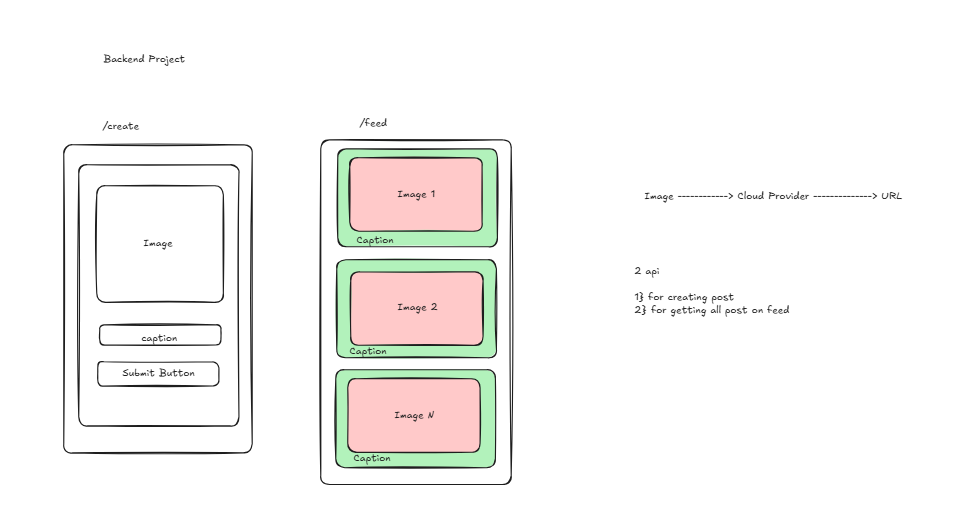

# Post X 🚀

Post X is a simple social media web application built using the MERN Stack.  
Users can create posts and view them in a live feed.

## 🔥 Features
- Create new posts
- View all posts in feed
- REST API with Express
- MongoDB database integration
- Responsive React frontend

## 🛠️ Tech Stack
- MongoDB
- Express.js
- React.js
- Node.js

## ⚙️ Installation

### 1️⃣ Clone the repository
git clone <your-repo-link>

### 2️⃣ Install backend dependencies
cd backend  
npm install  
npm start  

### 3️⃣ Install frontend dependencies
cd frontend  
npm install  
npm start  

## 🌐 Usage
Open http://localhost:5173
Create a post and view it in the feed.

---

Built with ❤️ using MERN Stack